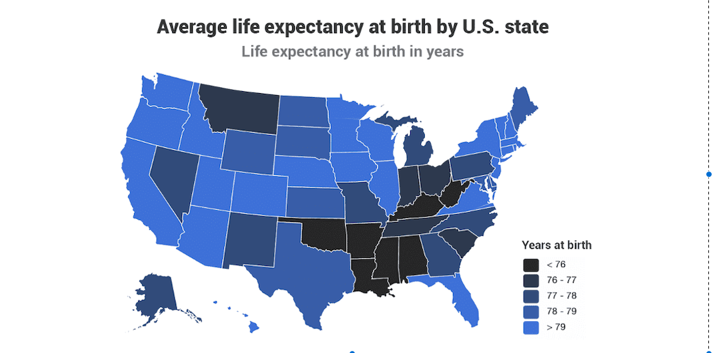
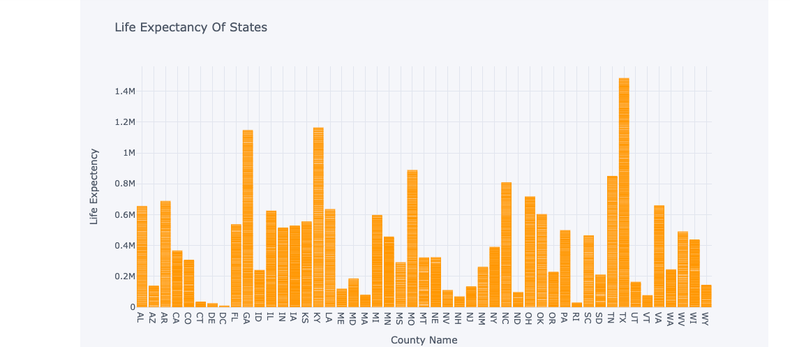

# Predicting_Life_Expectancy

Summary map:

# <a id='7'>Increase the life-span by taking care of these factors</a>

Map figures:

# <a id='7'>Summary</a>
We used the dataset County Health Data gathered by The Robert Wood Johnson Foundation and University of Wisconsin. [link]
(https://www.rwjf.org/en/how-we-work/grants-explorer/featured-programs/county-health-ranking-roadmap.html)
We analysed the dataset to find out about biggest contributers to longer life-span and compared county where people live longer compared to other counties. Furthermore, we run a machine learning model to find the best predictors for life expectancy ; furthermore , we can use this model for government officials to see the lifespan effect of their work for the future.

# <a id='7'>Outline</a>
Data gathering and preprocessing.
Data Manipulation and Analysis.
Feature Selection and Eliminiation.
Model building and iteractive model selection.

# <a id='7'>Conclusion</a>
We have looked at county's and their health indexes however, by this approach we eliminated some of the health factor that are actually important for personal health but not so common in society in general like(obesity). Further analysis is needed and we should adjust some of the columns with their weight in order to not loose some valuable information. In conclusion, we have found that if government pushes its citizens to make sports and build facilities for sports we can increase the lifespan.

  

